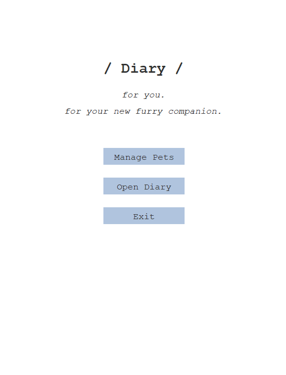
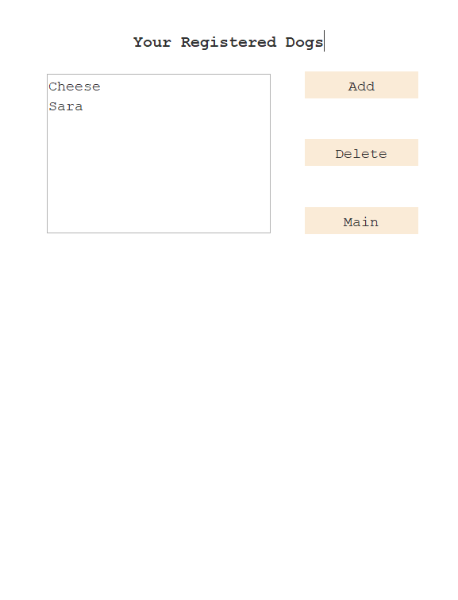
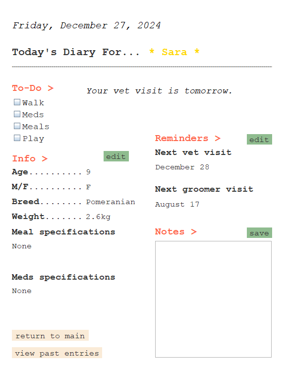
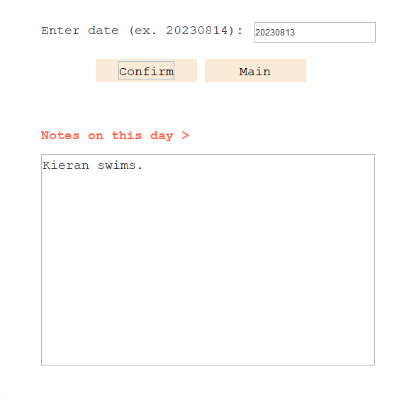

# :dog::cat: Pet Diary :notebook_with_decorative_cover::pen:

Ever felt overwhelmed :worried: with your very first pet's needs? Do you keep forgetting vet appointments, or want a dedicated space to keep vital information? 

Introducing **Pet Diary**, where you can start managing your pet :dog: in a single application. **Pet Diary** is a Java GUI application developed on top of Eclipse's **WindowBuilder**.  

Have more than one pet? :cat: Fear not, for you can register more than one pet and manage them here.  

Enter the main page of the diary to access all information about your beloved pet. Get notifications for your vet :hospital: visits, record her physical information, and make relevant notes :pen: for today. 

Sometimes, you just want to sit down and reminisce :rewind: your pet's younger days. Our application stores past diary entires just for you. Read what you have written about your pet in the past!   

With **Pet Diary**, raising pets have never been more of a breeze :wind_face:. Start using **Pet Diary** now. 

#### Authors
- Seolin Jung [@seolinjung](https://github.com/seolinjung)
- Isabel Fadhel [@isabelfadhel](https://github.com/isabelfadhel)
